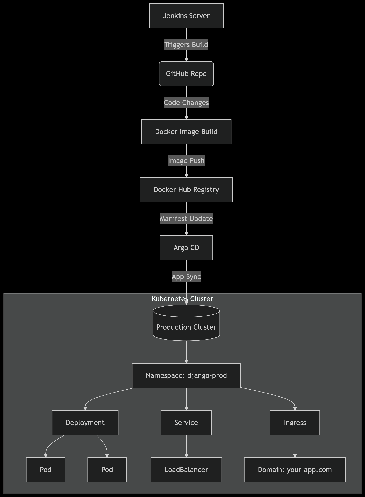

## Continuous Integration and Deployment (CI/CD) for a python Django based website 

This project uses **Jenkins** for continuous integration and **Argo CD** for continuous deployment, following this workflow:

### Jenkins Pipeline

1. **Checkout**: Jenkins pulls the latest code from the main branch of the GitHub repository.
2. **Dependencies and Testing**: Runs inside a Python 3.10 Docker container, installs dependencies, and executes tests with pytest and pytest-django.
3. **Docker Build and Push**: Builds a Docker image tagged with the Jenkins BUILD_NUMBER and pushes it to Docker Hub (shoaibismail18/django-k8s).
4. **Deployment Manifest Update**: Updates the Kubernetes deployment manifest (k8s/deployment.yml) with the new image tag, commits, and pushes changes back to GitHub.

### Argo CD Continuous Deployment

- **Argo CD watches the GitHub repository** for changes in the Kubernetes manifests.
- Once the deployment manifest is updated by Jenkins, Argo CD automatically **deploys the latest Docker image** to the Kubernetes cluster.
- The Kubernetes cluster is configured with:
  - An **Ingress** resource to manage external access.
  - An **Ingress Controller** of type **LoadBalancer** to route incoming traffic to the Django application.

### Prerequisites for Setup

- Jenkins with credentials for GitHub (GitHub_credentials) and Docker Hub (docker-django-k8s).
- Kubernetes cluster with:
  - Manifests in Github project directory.
  - Argo CD installed and connected to the GitHub repository.
  - Configured Ingress and Ingress Controller (LoadBalancer type).

